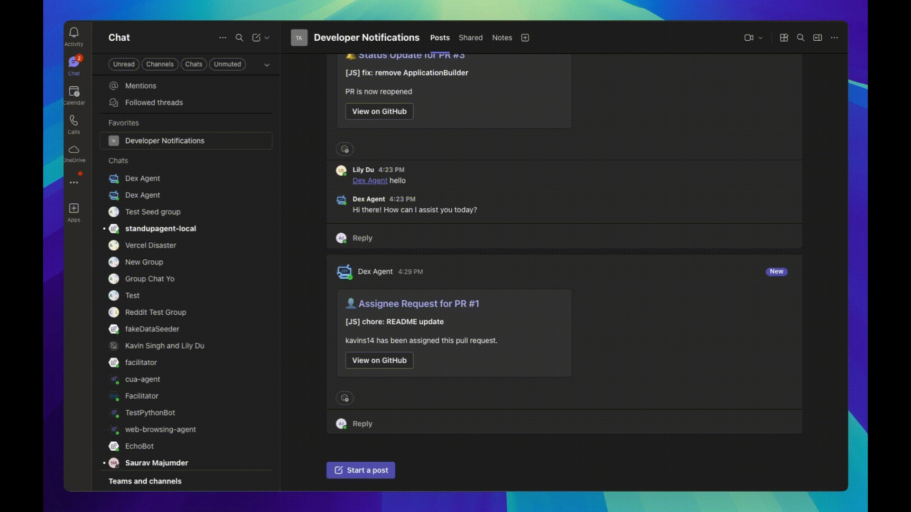
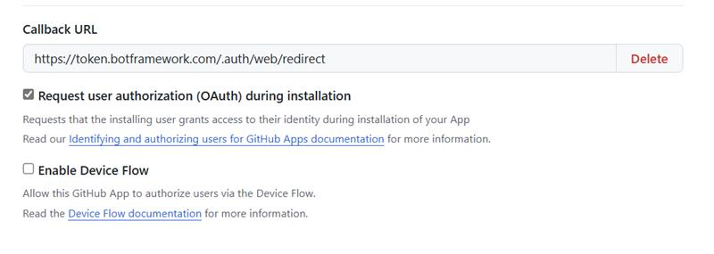
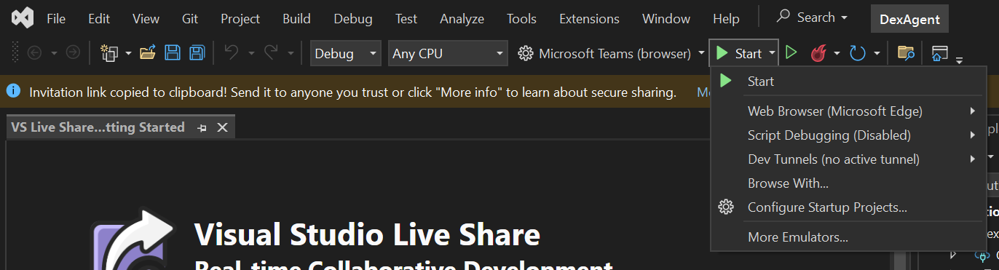
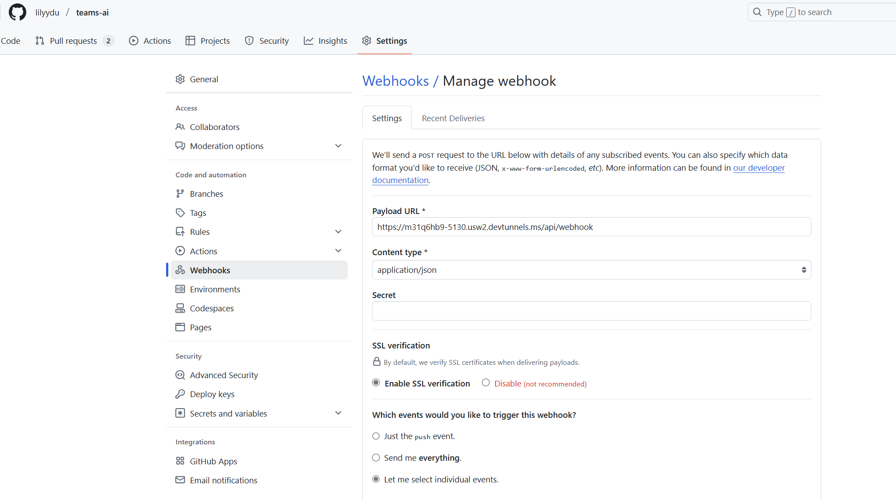

<!--
---
id: dex-agent
title: "Developer Experience Agent"
description: "A customizable agent that enhances developer experience and team productivity."
longDescription: |
  This sample showcases how an agent can enhance the Developer Experience (DEX) on Microsoft Teams using Semantic Kernel, Azure Open AI, and GitHub Apps. 

featuresList:
  - "📄 Displays a list of your repository's pull requests"
  - "🔍 Filter PRs based on labels, assignees, and/or authors"
  - "🔔 Be notified in group chats and channels when there is a new assignee on a PR"
  - "🔔 Be notified in group chats and channels when there is a status update on a PR"
tags:
  - "semantic-kernel"
  - "github"
  - "azure-openai"
githubUrl: "https://github.com/microsoft/teams-agent-accelerator-samples/blob/main/dotnet/dex-agent"
imageUrl: "https://github.com/microsoft/teams-agent-accelerator-samples/raw/main/dotnet/dex-agent/assets/devex-thumbnail.png"
author: "Microsoft"
language: "C#"
demoUrlGif: "https://github.com/microsoft/teams-agent-accelerator-samples/raw/main/dotnet/dex-agent/assets/listPRs.gif"
demoYoutubeVideoId: ""
---
-->

# DEX Agent for Microsoft Teams

Enhance your developer experience (DEX) on Microsoft Teams with this customizable agent. Built using Semantic Kernel, Azure OpenAI, and GitHub Apps, the DEX Agent streamlines pull request management and notifications, boosting team productivity.

## Features

- 📄 **List Pull Requests:** View all pull requests in your repository.

  
- 🔍 **Filter Pull Requests:** Filter PRs by labels, assignees, and/or authors.

  
- 🔔 **PR Assignment Alerts:** Get notified in Teams when a PR is assigned.

  
- 🔔 **PR Status Alerts:** Receive proactive notifications on PR status changes.

  

## Prerequisites

- [.NET 9.0 SDK](https://dotnet.microsoft.com/en-us/download/dotnet/9.0)
- [Teams Toolkit Extension](https://learn.microsoft.com/en-us/microsoftteams/platform/toolkit/toolkit-v4/install-teams-toolkit-vs?pivots=visual-studio-v17-7)
- [Register your agent as a GitHub App](https://docs.github.com/en/apps/creating-github-apps/registering-a-github-app/registering-a-github-app)
  - Save the `Client ID` and `Client Secret`.
  - Set the callback URL (e.g., `https://token.botframework.com/.auth/web/redirect`).


## Getting Started

1. **Open the Solution:** Launch in Visual Studio.
2. **Configure Keys:** Fill in Azure and GitHub keys in `appsettings.Development.json`:
    ```json
	"github": {
		"ClientId": "",
		"ClientSecret": "",
		"Owner": "",
		"Repository": ""
	},
	"Azure": {
		"OpenAIApiKey": "",
		"OpenAIEndpoint": "",
		"OpenAIDeploymentName": "gpt-4o",
		"OpenAIModelId": "gpt-4o"
	}
    ```
3. **Update `TeamsApp/env/.env.local`:** Populate `GITHUB_CLIENT_ID`, `GITHUB_CLIENT_SECRET` and `OAUTH_CONNECTION_NAME`.
4. **Create a Dev Tunnel:** In the debug dropdown, select `Dev Tunnels > Create A Tunnel` (Persistent & Public).

6. **Run the App:** Press F5 or click on `Start`.

## Configure GitHub Webhooks

1. Go to your repository settings > Webhooks > Add webhook.
2. Set the payload URL to your `BOT_ENDPOINT` from `.env.local`, ending with `/api/webhook`.
   - Example: `https://<your-tunnel>.devtunnels.ms/api/webhook`
3. Select individual events and check `Pull Requests`.


More information is available [here](https://docs.github.com/en/apps/creating-github-apps/registering-a-github-app/using-webhooks-with-github-apps).

## Extending to Other Repository Tools

- Only one repository tool can be configured at a time.
- Update authentication keys and configuration files for your tool.
- Implement a service class extending `IRepositoryService` and a plugin extending `IRepositoryPlugin`.
- Define your data models for PRs similar to `DexAgent/GitHubModels/` (see `GitHubPR.cs`, `GitHubUser.cs`, `GitHubLabel.cs`, etc.).
- Register your service and plugin in `Program.cs` and update Semantic Kernel registration.
- Update activity handlers and webhook routing as needed:
  - Use `controllers/ApiController.cs` for webhook routing.
  - Use `controllers/TeamsController.cs` for Teams activity handlers. See `[AdaptiveCard.Action]` for examples of manually invoking kernel functions.

## Conversation Management

Use `KernelOrchestrator` methods to manage conversation history and update plugin references in orchestration logic.
