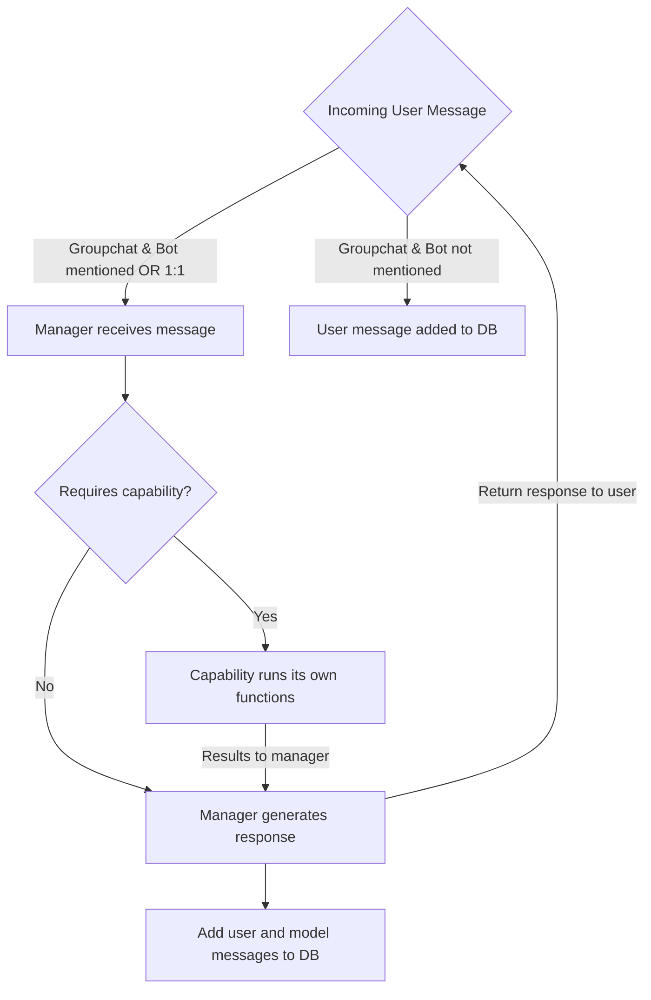

<!--
---
id: collaborator-agent
title: "Collaborator Agent"
description: "Collaboration agent with advanced conversation analysis and task management capabilities."
longDescription: |
  This sample is built with the Teams AI Library v2, and showcases how to create an intelligent collaboration assistant that can analyze conversations, manage action items, and search through chat history using natural language processing and time-based queries.

featuresList:
  - "📋 Intelligent conversation summarization with participant attribution"
  - "✅ Automatic action item identification and task management"
  - "🔍 Natural language search through conversation history"
  - "⏰ Time-based queries with natural language parsing"
tags:
  - "ai"
  - "collaboration"
  - "conversation-analysis"
  - "task-management"
githubUrl: "https://github.com/microsoft/teams-agent-accelerator-templates/blob/main/js/collaborator-agent"
author: "Microsoft"
language: "TypeScript"
demoYoutubeVideoId: "RuIfcNcBB_8"
---
-->

# Collaborator Agent for Microsoft Teams

This intelligent collaboration assistant is built with the [Teams AI Library v2](https://aka.ms/teamsai-v2), and showcases how to create a sophisticated bot that can analyze conversations, manage tasks, and search through chat history using advanced AI capabilities and natural language processing.

This agent can listen to all messages in a group chat (even without being @mentioned) using RSC (Resource Specific Control) permissions defined in [App Manifest](appPackage/manifest.json). For more details, see the documentation [RSC Documentation](https://staticsint.teams.cdn.office.net/evergreen-assets/safelinks/2/atp-safelinks.html).

## Key Features

- 📋 **Intelligent Summarization** - Analyze conversations and provide structured summaries with proper participant attribution and topic identification
- ✅ **Action Items** - Automatically identify and create action items from team discussions with smart assignment
- 🔍 **Conversation Search** - Search through chat history using natural language queries with time-based filtering and deep linking to original messages

## Adding Custom Capabilities

Adding your own capabilities only requires a few steps:

1. Copy the template folder under capabilities [template](src\capabilities\template\template.ts)
2. Customize your capability to do what you want (helpful to look at existing capabilities)
3. Make sure to create a CapabilityDefinition at the bottom of your main file
4. Register your capability by importing the CapabilityDefinition and adding to the definition list in [registry](src\capabilities\registry.ts)
5. The manager will automatically be instantiated with the capability you defined!

## Agent Architecture

```mermaid
  A[Manager]

  A --> B(Summarizer)
  A --> C(Action Items Creation)
  A --> D(Search)
  A --> E(Add your own capabilities!)
```

## Flow of the Agent



If Collab Agent is added to a groupchat or private message, it will always listen and log each message to its database. The messages are stored in an SQLite DB by the conversation ID of the given conversation. 
The agent will respond whenever @mentioned in groupchats and will always respond in 1-on-1 messages. When the agent responds, the request is first passed through a manger prompt.
This manager may route to a capability based on the request--this capability returns its result back to the manager where it will be passed back to the user.


## Running the Sample

### Prerequisites

- [Node.js](https://nodejs.org/) version 18.x or higher
- [npm](https://www.npmjs.com/) (comes with Node.js)
- [Teams Toolkit Extension](https://marketplace.visualstudio.com/items?itemName=TeamsDevApp.ms-teams-vscode-extension) for Visual Studio Code
- [Visual Studio Code](https://code.visualstudio.com/)
- A Microsoft Teams account with the ability to upload custom apps
- Azure OpenAI resource with GPT-4 deployment

### Installation

1. Clone this repository:

    ```bash
    git clone https://github.com/teddyam/collaborator-agent
    cd collab-ts
    ```

2. Install dependencies:
    ```bash
    npm install
    ```

### Environment Setup

1. Copy the sample environment file:

    ```bash
    cp sample.env .env
    ```

2. Update the `.env` file with your configuration:
    - `CLIENT_ID`: Your Microsoft Teams bot ID (will be automatically generated if using Teams Toolkit)
    - `CLIENT_SECRET`: Your bot's password (will be automatically generated if using Teams Toolkit)
    - `AOAI_API_KEY`: Your Azure OpenAI API key
    - `AOAI_ENDPOINT`: Your Azure OpenAI endpoint URL
    - `AOAI_MODEL`: Your GPT-4 model deployment name
    - See `.env` for more details.

### Running the Bot

1. Open the project in Visual Studio Code
2. Press F5 to start the debug session (Debug Edge)
3. Teams Toolkit will handle:
    - Starting the local bot server
    - Tunneling for external access
    - Opening Teams with your bot loaded
4. @mention the bot in any conversation to start using its capabilities!

#### Sample Questions

You can ask the Collaborator agent questions like:

**Summarization:**
- "@Collaborator summarize yesterday's discussion"
- "@Collaborator what were the main topics from last week?"
- "@Collaborator give me an overview of recent messages"

**Action Items:**
- "@Collaborator find action items from the past 3 days"
- "@Collaborator create a task to review the proposal by Friday"
- "@Collaborator what tasks are assigned to me?"

**Search:**
- "@Collaborator find messages about the project deadline"
- "@Collaborator search for conversations between Alice and Bob"
- "@Collaborator locate discussions from this morning about the budget"

## Architecture

The Collaborator agent uses a sophisticated multi-capability architecture:

- **Manager**: Coordinates between specialized capabilities and handles natural language time parsing
- **Summarizer**: Analyzes conversation content and provides structured summaries
- **Action Items**: Identifies tasks, manages assignments, and tracks completion
- **Search**: Performs semantic search across conversation history with citation support
- **Context Management**: Global message context handling for concurrent request support

## Deployment

The bot can be deployed to Azure App Service for production use. See deployment documentation for detailed instructions on setting up Azure resources and configuring the production environment.