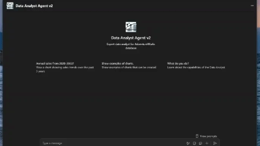

<!--
---
id: data-analyst-agent-v2
title: "Data Analyst Agent"
description: "Natural language interface for data exploration and visualization."
longDescription: |
  This sample demonstrates how to build an AI-powered data analyst agent that can be integrated into Microsoft Teams. It helps users explore and visualize data through natural language conversations and Adaptive Cards charts.

  Check out the [LinkedIn post](https://www.linkedin.com/feed/update/urn:li:activity:7305726858308792321/) for a video of the sample in action.
featuresList:
  - "🔍 Query databases using natural language"
  - "📊 Generate visualizations using Adaptive Cards from query results"
  - "📈 Analyze data patterns and trends"
  - "🔄 'reset' command to clear the conversation history."
tags:
  - "llm-sql"
  - "adaptive-cards"
  - "data-viz"
githubUrl: "https://github.com/microsoft/teams-agent-accelerator-samples/blob/main/js/data-analyst-agent"
imageUrl: "https://github.com/microsoft/teams-agent-accelerator-samples/raw/main/js/data-analyst-agent/assets/data-analyst-thumbnail.png"
author: "Microsoft"
language: "JavaScript"
demoUrlGif: "https://github.com/microsoft/teams-agent-accelerator-samples/raw/main/js/data-analyst-agent/assets/demo.gif"
demoYoutubeVideoId: "HQDvwoJbhRE"
---
-->

# Data Analyst Agent for Microsoft Teams

This sample demonstrates how to build an AI-powered data analyst agent that can be integrated into Microsoft Teams. It helps users explore and visualize data through natural language conversations and Adaptive Cards charts.

Check out the [LinkedIn post](https://www.linkedin.com/feed/update/urn:li:activity:7305726858308792321/) for a video of the sample in action.

## Features

- 🔍Query databases using natural language
- 📊 Generate visualizations using [Adaptive Cards](https://adaptivecards.microsoft.com/?topic=welcome) from query results
- 📈 Analyze data patterns and trends
- 🔄 `"/reset"` command to clear the conversation history.

## Demo



## Running the Sample

### Prerequisites

- [Node.js](https://nodejs.org/) version 18.x or higher
- [npm](https://www.npmjs.com/) (comes with Node.js)
- [Teams Toolkit Extension](https://marketplace.visualstudio.com/items?itemName=TeamsDevApp.ms-teams-vscode-extension) for Visual Studio Code
- [Visual Studio Code](https://code.visualstudio.com/)
- A Microsoft Teams account with the ability to upload custom apps
- OpenAI API Key or Azure OpenAI resource.

### Installation

1. Clone this repository:

    ```bash
    git clone https://github.com/microsoft/teams-agent-accelerator-samples
    cd js/data-analyst-agent
    ```

2. Install dependencies:
    ```bash
    npm install
    ```

### Environment Setup

1. Copy the sample environment file:

    ```bash
    cp sample.env .env
    ```

2. Update the `.env` file with your configuration:
    - `BOT_ID`: Your Microsoft Teams bot ID (will be automatically generated if using Teams Toolkit)
    - `BOT_PASSWORD`: Your bot's password (will be automatically generated if using Teams Toolkit)
    - Azure OpenAI or OpenAI configurations. See `sample.env` for more details.

### Running the Bot

#### Option 1: Local deployment using Teams Toolkit (Recommended)

1. Open the project in Visual Studio Code
2. Press F5 to start the debug session (Debug Edge)
3. Teams Toolkit will handle:
    - Starting the local bot server
    - Tunneling for external access
    - Opening Teams with your bot loaded

#### Option 2: Deploy to Azure using Teams Toolkit

1. Create an empty `.env.dev` file and place it in the `env` folder.
2. Create a `.env.dev.user` file in the `env` folder and add the following contents to it:

```
SECRET_AZURE_OPENAI_API_KEY=<api key>
SECRET_AZURE_OPENAI_API_BASE=<api base> // Example: https://<id>-eastus2.openai.azure.com/
SECRET_AZURE_OPENAI_API_VERSION=<api version> // Example: 2024-08-01-preview
```

3. Navigate over to the Teams Toolkit Extension in VSCode, and login to your Azure & M365 credentials.
4. Then select "Provision" under the "Lifecycle" tab. Follow the instructions to select a resource group, and then click "Provision".
5. Once the resources have been provisioned successfully, select "Deploy". It can take 5-10 minutes to deploy your app.
6. Once the app has been deployed successfully, sideload `appPackage.dev.zip` file into Teams following the instructions [here](https://learn.microsoft.com/en-us/microsoftteams/platform/concepts/deploy-and-publish/apps-upload).

To learn more about `Deploying to Azure using Teams Toolkit` see [this](https://learn.microsoft.com/en-us/microsoftteams/platform/toolkit/provision).

## Appendix

### Dataset

This agent uses the AdventureWorks sample database, a Microsoft-provided dataset that simulates a bicycle manufacturer's data. The database includes:

#### Core Business Areas

- **Sales**: Orders, customers, territories
- **Production**: Products, inventory, work orders
- **Purchasing**: Vendors, purchase orders
- **HR**: Employees, departments
- **Person**: Contact information

#### Sample Questions

You can ask the agent questions like:

- "Show me the top-selling products this year"
- "What's the sales trend by territory?"

See the [AdventureWorks README](src/data/README.md) for more details.

**Core Components**

- **Data Analyst Agent**: Main orchestrator that handles user requests. Handles database queries and also creates visualizations using Adaptive Cards.
- **Base Agent**: Handles LLM calls and orchestration. Other agents are built on top of this.

### Running Evals

This project includes evaluation scripts to test the agent's ability to generate SQL queries and Adaptive Card visualizations.

#### SQL Generation Evaluation

To evaluate the agent's SQL query generation capabilities:

```bash
# Run all SQL test cases
npm run eval:sql

# Run a single test case (useful for debugging)
npm run eval:sql:one
```

The evaluation will:
1. Load test cases from `evals/sql-eval.jsonl`
2. Generate SQL queries for each test case
3. Compare the generated queries against expected results
4. Output results to both console and a log file in `evals/logs/sql-eval-[timestamp].log`

#### Adaptive Card Generation Evaluation

To evaluate the agent's Adaptive Card visualization capabilities:

```bash
# Run all Adaptive Card test cases
npm run eval:ac

# Run a single test case (useful for debugging)
npm run eval:ac:one
```

The evaluation will:
1. Load test cases from `evals/ac-eval.jsonl`
2. Generate Adaptive Cards for each test case
3. Compare the generated cards against expected results
4. Output results to both console and a log file in `evals/logs/ac-eval-[timestamp].log`

Both evaluations will provide detailed feedback including:
- Success rate
- Individual test case results
- Expected vs actual outputs
- Judge's reasoning for each evaluation