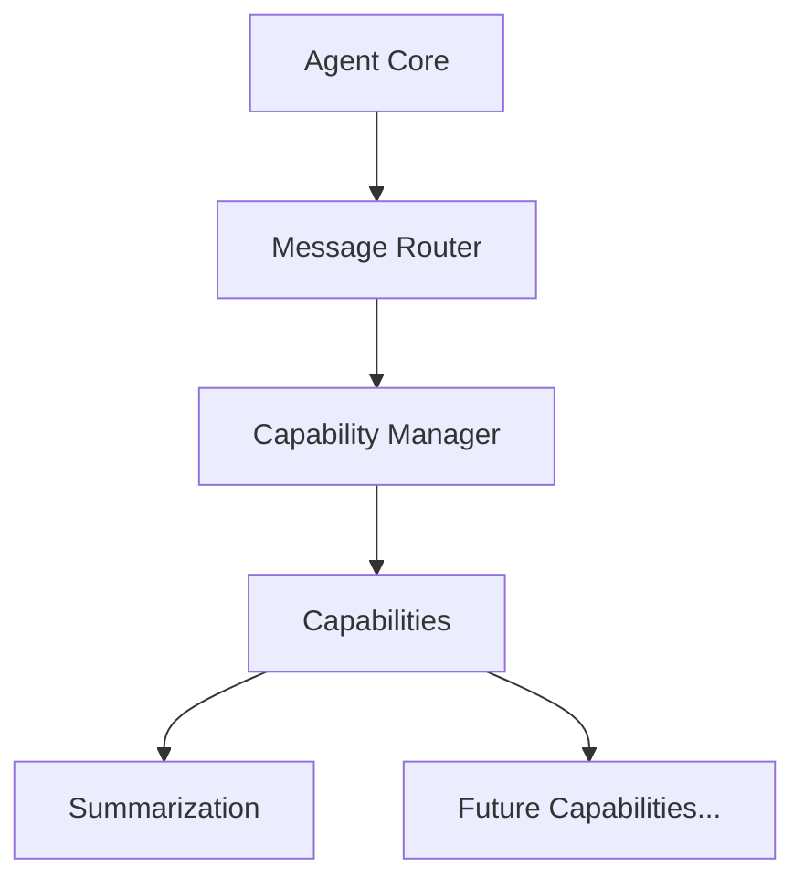
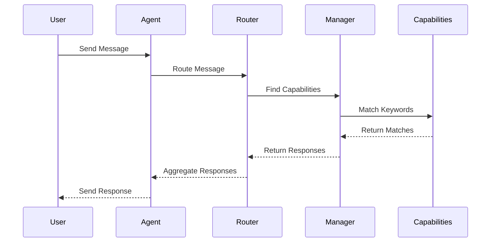

# Teams Agent System Patterns

## Core Architecture



## Key Components

### 1. Agent Core (`src/agent/core.ts`)
- Entry point for the application
- Handles application lifecycle
- Manages authentication and user sessions
- Coordinates message flow
- Provides access to Teams API

### 2. Message Router (`src/agent/router.ts`)
- Routes incoming messages to appropriate capabilities
- Handles message distribution
- Aggregates capability responses
- Ensures ordered message processing

### 3. Capability Manager (`src/capabilities/manager.ts`)
- Manages capability registration
- Maintains capability registry
- Matches messages to capabilities via keywords
- Coordinates capability responses

### 4. Capability Interface (`src/capabilities/base.ts`)
```typescript
interface Capability {
  id: string;
  name: string;
  description: string;
  keywords: string[];
  handleMessage(message: MessageActivity): Promise<MessageActivity | null>;
}
```

## Design Patterns Used

### 1. Plugin Architecture
- Capabilities function as plugins
- Loose coupling between core and capabilities
- Dynamic capability registration
- Independent capability lifecycle

### 2. Event-Driven Design
- Message-based communication
- Asynchronous processing
- Event handlers for core functionality

### 3. Repository Pattern
- Centralized capability management
- Abstracted capability storage
- Controlled capability access

### 4. Strategy Pattern
- Each capability implements common interface
- Interchangeable message handling strategies
- Consistent capability behavior

## Message Flow



## Implementation Guidelines

### Adding New Capabilities
1. Create new directory under `src/capabilities/`
2. Implement Capability interface
3. Register with CapabilityManager
4. Export from index.ts

### Message Processing
1. Messages received by Agent Core
2. Routed through MessageRouter
3. Matched against capability keywords
4. Processed by matching capabilities
5. Responses aggregated and returned

### Error Handling
- Core handles authentication errors
- Capabilities manage their internal errors
- Router handles routing failures
- Manager handles registration errors

## Future Considerations
1. Capability priority/ordering
2. Message history/context
3. Concurrent capability processing
4. Capability dependencies
5. State management
6. Rate limiting
